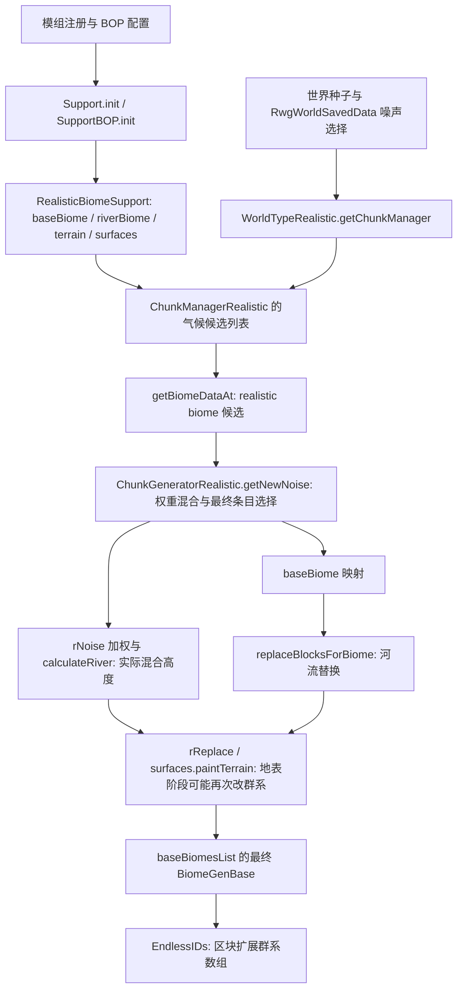

# v34：基于实际 GTNH 环境的通用主世界群系回放

后续 v36 在此精算流程前增加了地表群系依赖检查：没有最终群系数组依赖的区块使用精确混合与河流路径，其余保留本文完整回放。详见 [v36 自适应精算](gtnh-v36-adaptive.md)。本文保留原始生成链核查记录。

## 核对环境

本次检查的是 PrismLauncher 中的 `GT_New_Horizons_2.9.0-beta-3_Java_17-26` 实例。
下面来自该实例的 JAR、配置和 Worker 端口返回值，不是按原版 Minecraft 群系推测。

| 组件 | 实际文件 / 配置 |
| --- | --- |
| RWG | `RWG-alpha-1.5.2.jar`，SHA-256 `9be5c54b56cf2a08d507a5568dec1537ca6f5e958a2ce9d39e32207870a6bd6f` |
| BOP | `BiomesOPlenty-1.7.10-2.1.0.2308-universal.jar`，SHA-256 `5382d1c156c871c896b6cebd036b80f58ceaff36b09d416b113f32884b7b4a2a` |
| EndlessIDs | `endlessids-mc1.7.10-1.7.4.jar`；日志确认 RWG `RealisticBiomeBaseMixin` 已加载 |
| Hodgepodge | `hodgepodge-2.7.196.jar`；包含 BOP 原版群系覆盖与扩展 ID 兼容补丁 |
| BOP 配置 | Brushland、Heathland、Outback 启用；Desert、Forest、Savanna 等原版条目覆盖启用 |
| 配置与运行时一致的 ID | Brushland=48、Heathland=70、Outback=92、RWG Hot Desert=230 |
| 端口 | `127.0.0.1:47117`，协议 18 |
| 本轮运行时存档 | 种子 `2777967236474336022`，worldType=`RWG`，manager=`rwg.world.ChunkManagerRealistic` |

本地检查资料在 `build/biome-accuracy-reference/`，包含配置副本、反编译对照、
握手返回和采样 JSON。构建与发布包不包含完整第三方模组 JAR。

## 游戏里的实际调用链



1. **BOP 集成发生在候选注册阶段。** `SupportBOP.init()` 将实际 BOP 对象包进
   `RealisticBiomeSupport`，附带地形、地表和河流规则，再加入 RWG 的气候列表。
   原版条目也可能已经被 BOP 覆盖，不能从名字 `Desert` 或一个固定 ID 判断实现。
2. **两套 ID 含义不同。** `RealisticBiomeBase.biomeID` 用于 RWG 混合数组；
   `baseBiome.biomeID` / `riverBiome.biomeID` 才是最终游戏群系 ID。一个最终
   群系可以对应多个 realistic 条目，它们的地形与地表规则不同。
3. **噪声不能只看 seed。** `NoiseSelector.createNoiseGenerator(seed)` 还读取
   `RwgWorldSavedData` 的噪声实现。运行中的 Worker 使用实际 manager；换存档、
   噪声实现、模组版本或配置后，必须重新验证，不能认为任意同种子存档都相同。
4. **`getBiomeDataAt` 不是最终结果。** RWG 在 8 方块采样网格上累计抛物线权重，
   经过多级插值，再按噪声阈值选择 realistic 条目。中心占比超过 95% 时可直接
   选择条目，但地形高度仍会混合全部有效邻居，不能因此只算单一群系高度。
5. **河流不是最后一步。** `replaceBlocksForBiome` 先按河流强度与噪声改
   `baseBiomesList`，随后调用 `rReplace`，后者的地表 painter 仍能覆盖群系。
6. **最终读数来自区块。** EndlessIDs 的 `ChunkGeneratorRealisticMixin`
   将 `baseBiomesList` 写进扩展 short 群系数组。不能自己读原版 byte 数组并
   `& 255`。Worker 继续通过 `world.getBiomeGenForCoords` 读取已加载区块，
   并以 JSON 整数传输群系 ID。

`getNewNoise` 中的高度数组按 `localX * 16 + localZ` 存储，而群系数组按
`localZ * 16 + localX` 存储。这一差别在对照测试中逐点检查，不能统一套同一种索引。

## Worker 和 Viewer 的调用链

地图背景：`BiomeDataLoader → Fragment.populateBiomeData → BiomeDataOracle →
GtnhMinecraftInterface.Accessor.getBiomeData → GtnhBiomeWorkerClient.sampleBiomes →
TCP → BiomeWorkerServer.sampleOverworldBiomes → SurfaceBiomeSamplers`。

- 当前加载的 RWG 主世界与请求种子相同时，已加载区块返回游戏的最终群系；
  未加载坐标由同一个 manager 的预测器计算。
- 主菜单或其他种子通过 `SeedOnlyWorld` 创建 RWG manager，仅用于预测；
  预测查询不调用 `provideChunk`，不会为地图预览生成存档区块。
- Viewer 普通地图背景是 `step=4`，每格取 `(格原点 X+2, Z+2)` 作为代表。
  这个结果覆盖整格，但不能当成格内每个精确方块的群系。

## 通用生成流程与显示精度

### 1. 将缺失的生成阶段接回预测链

沙漠只是漏掉地表阶段的一个可复现例子，不应成为生产代码中的专用判断。
`SurfaceDuneValley` 的覆盖规则证明了“选中 baseBiome / riverBiome 就返回”是不完整的。
v34 生产代码已经移除按 `SurfaceDuneValley` 类型读取参数并自行判断的规则。
旧规则只留在测试源码中，作为历史问题的对照，不会打入 Worker JAR。

`RwgChunkBiomeReplay` 对每个未缓存的区块执行以下通用步骤：

1. 使用当前 manager 的真实气候候选、噪声对象、稀疏混合权重，计算完整 16×16
   的 realistic 条目和混合高度。保留已通过实际 JAR 对照的混合与缓存实现。
2. 按高度在临时数组中填充石头、水和空气；数组索引与原始生成器一致。
3. 取区块局部 `(8,8)` 处非零权重的所有 realistic 对象，按内部 ID 升序调用
   它们实际的 `generateMapGen`。这补上了单独地表规则无法反映的地形修改阶段。
4. 按原生成器的 Z/X 顺序逐列处理河流，再调用实际对象的 `rReplace`。
   BOP support 对象会自行执行它的全部 `surfaces[]`，原生群系也执行自己的覆盖方法。
   不需要 Viewer/Worker 知道返回的是森林、沼泽、山地、沙漠或其他群系。
5. 保持区块随机种子及每列基岩随机数消耗顺序；所有列完成后读取最终群系数组。
   回调可能读邻列或修改其他列，不能在单列完成时提前缓存结果。

回放只向一次性的方块/元数据数组写入；传给回调的是无存档 chunk provider 的
`SeedOnlyWorld`，不是实际 `WorldServer`。当前存档预测复用其 manager 与噪声选择。
不调用 `provideChunk` / `populate`，也不创建或保存真实存档区块。

缓存按世界/采样器与区块分开，最多 2048 个 BlendChunk，每个保留完整的 256 个
最终群系。相邻采样和光标查询复用结果；方块缓冲区只保留一份。发生异常的回放
不会把半成品写入结果缓存。不能初始化实际 API 时明确返回错误，不悄悄退回基础群系。

**精度边界：** RWG 混合数学仍由经过对照的缓存实现完成，并非整个原始
`ChunkGeneratorRealistic` 被直接运行。Forge `ReplaceBiomeBlocks` 事件、洞穴/结构、
`populate` 以及生成后的模组修改没有重放；事件监听器可能操作真实存档，不能直接
在地图查询中广播。此版本覆盖通用 RWG/BOP 地形与地表回调，不宣称任意模组的
全部后处理都能无差别预测。已加载区块仍以游戏数据为准，对照报告用于暴露剩余差异。

### 2. 光标精确坐标旁显示了 4×4 地图格的群系

这是在用户运行的 GTNH 存档中通过端口复现的：

| 同一存档的查询 | 坐标 | 结果 |
| --- | --- | --- |
| 精确方块 | X=-191，Z=-240 | Fen，ID 62 |
| 该地图格代表点 | X=-190，Z=-238 | Woodland，ID 121 |

旧光标标签从 Fragment 的四分之一分辨率数组取值，却在后面显示精确方块坐标。
在 `[-240,-177] × [-240,-177]` 的 4096 方块中，251 个方块的群系与其地图
格代表值不同。边界越细碎，这种显示差异越容易看到；这不等于随机预测错误率。

v34 保留的 `GtnhCursorBiomeLookup` 在光标停留约 150 ms 后异步查询 `step=1`，
同一时间最多一个请求。结果按精确坐标核对，丢弃过期坐标的返回；区块状态更新时
失效，关闭世界时取消。光标移动不会堆积网络任务，也不在 EDT 等待 Worker。

光标显示 `At block: ...` 与 `Map sample: ... (4x4 blocks)`；精确结果尚未返回
时只标记为地图采样值。地图背景仍使用既有分辨率；这次没有把全图采样量放大 16 倍。

## 验证证据及其范围

- **真实端口基线：** 当前种子，64×64 全分辨率区域的 4096 点，及出生点周围
  416×416 方块范围中的 10816 个四分之一分辨率代表点，旧 Worker 的主世界
  查询与同种子纯预测路径未发现差异。主要覆盖 Woodland、Fen、Coniferous
  Forest、Hot Plains 和河流。它没有覆盖所有 BOP 群系或整张地图。
- **旧版基线的限制：** 旧协议没有单独对照命令，本轮用主世界逻辑维度键选择
  主世界采样、用非 RWG 数字维度避开 live-world 快捷路径，获得纯种子预测。
  普通 `biomes` 对未加载坐标会自动预测，不能把所有成功响应都视为已加载证据。
  新版的正式对照命令明确标出未加载位置，后续应使用它。
- **实际 RWG 字节码对照：** `InstalledRwgReferenceTest` 从该 SHA-256 的 JAR
  提取 `getNewNoise`、`mix4`、`SurfaceDuneValley.paintTerrain`，只适配受控输入
  类型和噪声接口调用，不用另一份 Worker 算法作为答案。5120 个点的 realistic
  条目和混合高度完全一致；1224 种地表输入全部一致，其中 800 种触发旧版本
  漏掉的沙漠覆盖。测试包含河流初值、不同谷地参数、混合开关、负坐标及高度边界。
- **通用回放与实际字节码：** 新增直接执行该 JAR 的 `replaceBlocksForBiome`，在 2048 个方块上对照河流、任意群系写入、跨列修改及随机数顺序，结果完全一致。受控回调不是整包全部 BOP 实测；另外 5 项测试覆盖回调顺序、缓存、失败重试与分阶段诊断。
- **Viewer 真实端口验证：** 用 v33 发布 JAR 的 `GtnhMinecraftInterface`
  和 `GtnhCursorBiomeLookup` 连到运行中的 Worker，确认上述坐标精确查询返回
  Fen，同时地图格仍返回 Woodland。日志为 `live-v33-cursor-check.log`。
- **尚未完成的验证：** v34 Worker 的通用回放尚未在该 GTNH 游戏进程中加载。
  不能声称所有群系边界已经修复。任意模组的
  生成事件、地形雕刻、生成后的群系修改，以及旧版本/旧配置生成的区块，仍须
  用实际区块对照；本预测器没有完整重放所有方块与后处理。

## 可重复的检查方法

带实际 RWG JAR 的完整构建：

```powershell
.\gradlew.bat assembleRelease '-PrwgReferenceJar=C:/path/to/RWG-alpha-1.5.2.jar' --offline
```

单独运行字节码对照：

```powershell
.\gtnh-worker\gradlew.bat -p gtnh-worker test --tests '*InstalledRwgReferenceTest' '-PrwgReferenceJar=C:/path/to/RWG-alpha-1.5.2.jar' '-Pgtnh.modules.codeStyle=false' --offline
```

未传 `rwgReferenceJar` 时这三项测试明确跳过，其余测试照常运行；新 RWG 版本
需先核对并更新适配器和 SHA-256，不应直接删掉版本断言。无需在仓库提交第三方 JAR。

更新至 v34 Worker 并进入单人存档后，用正式对照工具采集：

```powershell
.\gtnh-worker\tools\Compare-WorkerBiomes.ps1 -X -240 -Z -240 -Width 64 -Height 64 -OutputPath biome-comparison.json
```

工具从 `hello` 获取当前种子；`compare_biomes` 仅处理当前已加载的 RWG 主世界，
逐点比较“强制预测”与游戏最终群系。未加载点用 `-1` 标出并排除统计，不加载
或生成新存档区块。输出记录实际与预测 ID、名称和坐标；按实际群系列出覆盖数量与误差数量，并输出混淆统计。v34 还为误差点记录 realistic 类/内部 ID、混合后的 base ID、河流 ID 和最终 ID；便于判断差异在哪个阶段出现，不记录口令。

`compare_biomes` 是协议 18 的新增可选命令，旧 Worker 不支持。旧 Viewer 可连接
新 Worker；要使用新的精确光标显示，则需更新 Viewer。替换 Worker 后必须重启游戏。

## 后续修改入口

| 文件 | 职责 |
| --- | --- |
| `SurfaceBiomeSampler.java` | raw 条目、稀疏权重、最终条目、混合高度、河流顺序 |
| `RwgChunkBiomeReplay.java` | 临时地形数组、真实 map/surface 回调、随机顺序与最终群系 |
| `BiomeWorkerServer.java` | 请求坐标、live/prediction 路径和 `compare_biomes` |
| `InstalledRwgReferenceTest.java` | 直接执行实际 RWG 字节码的对照 |
| `GtnhCursorBiomeLookup.java` | 精确方块的异步查询、去抖、失效与关闭 |
| `CursorInformationWidget.java` | 分开显示方块结果与地图采样值 |
| `Compare-WorkerBiomes.ps1` | 采集可复现的已加载区块误差报告 |

## 性能代价与验证结果

v34 的完整构建通过 146 项测试，10 项开发工具测试跳过。Worker 32 项全部通过，
包含实际 RWG JAR 的 3 项对照；Viewer 114 项通过。

`benchmarkSurface` 的受控输入测试中，4 张瓦片、每张 16384 个 step=4 样本：

| 输入 | 冻结 v0.2 基础预测 | v34 通用回放 |
| --- | ---: | ---: |
| 单一条目区域 | 216.2 ms | 394.4 ms |
| 混合边界区域 | 218.1 ms | 579.4 ms |

这是首次预测的准确度/计算量取舍，不是性能提升，也不是实际 GTNH 帧率测量。
基准的地形噪声与回调是受控替身，不包含实际全部 BOP painter、网络或游戏线程争用；
不能据此估算整包耗时。基准文件 `surface-biomes-v34.json` 记录此次测量，旧版本
性能章节仅用于历史比较。通用回放的实际游戏耗时仍需更新 Worker 后测量。
